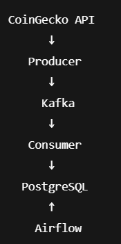

# Crypto ETL Pipeline (CoinGecko → PostgreSQL)

## Objective
Build a simple Data Engineering pipeline that fetches Bitcoin and Ethereum prices from the CoinGecko API and stores them in a PostgreSQL database.

## Architecture

This project contains two data pipelines:

### 1) Batch pipeline (ETL)
- Fetch crypto prices from CoinGecko API
- Store data in PostgreSQL
- Orchestrated with Airflow

### 2) Streaming pipeline (Kafka)
- Producer sends BTC/ETH prices to Kafka
- Consumer reads messages from Kafka
- Data is stored in PostgreSQL
- AKHQ used to monitor topics and messages



## Tech stack
- Python (requests, psycopg2, kafka-python)
- PostgreSQL (Docker)
- Apache Airflow (orchestration)
- Apache Kafka (streaming)
- AKHQ (Kafka monitoring UI)
- Docker & Docker Compose
- Logging (file + console)

## Features
- Fetch BTC / ETH prices from CoinGecko
- Store data into PostgreSQL table: `crypto_prices`
- Logs saved in `logs/etl.log`

## Project structure

- `src/`
  - `etl_crypto.py` → Batch ETL (API → PostgreSQL)
  - `producer_crypto.py` → Sends crypto prices to Kafka
  - `consumer_crypto.py` → Reads from Kafka and stores in PostgreSQL

- `dags/`
  - `crypto_kafka_producer_dag.py` → Airflow DAG to run the producer
  - `crypto_kafka_consumer_dag.py` → Airflow DAG to run the consumer

- `sql/`
  - SQL scripts to create tables

- `logs/`
  - Generated logs from ETL jobs

- `docker-compose.yml`
  - PostgreSQL
  - Airflow
  - Kafka
  - Zookeeper
  - AKHQ

This project can be executed in two ways:
- With Airflow (recommended)
- Locally using Python scripts


## ▶ How to run the streaming pipeline (Airflow + Kafka)

### 1) Start all services
```bash
docker compose up -d
```
### 1.1 Create PostgreSQL table
```bash
docker exec -i crypto_postgres psql -U crypto_user -d crypto_db < sql/create_tables.sql
```


### 2) Open Airflow
Go to:

http://localhost:8080

Login:
- username: admin
- password: admin

### 3) Run the pipelines
Trigger the DAGs from the Airflow UI:

- crypto_kafka_producer
- crypto_kafka_consumer

Run the producer first, then the consumer.

### 4) Monitor Kafka
Open:

http://localhost:8081

You can view:
- Topics
- Messages
- Consumer groups

### 5) Check data in PostgreSQL
```sql
SELECT * 
FROM crypto_prices
ORDER BY id DESC
LIMIT 10;
```
## ▶ Run producer & consumer locally (without Airflow)

### Run Producer
```powershell
$env:KAFKA_BOOTSTRAP_SERVERS="localhost:29092"
python src/producer_crypto.py --duration 20 --interval 10
```

### Run Consumer
```powershell
$env:KAFKA_BOOTSTRAP_SERVERS="localhost:29092"
python src/consumer_crypto.py --duration 20
```


## What this project demonstrates

This project showcases core Data Engineering skills:

- Building batch ETL pipelines using Python
- Working with external APIs (CoinGecko)
- Storing data in PostgreSQL
- Containerization with Docker
- Orchestrating workflows with Apache Airflow
- Implementing real-time data streaming with Apache Kafka
- Creating Producer/Consumer architectures
- Monitoring Kafka topics using AKHQ
- Managing environment configuration and services
